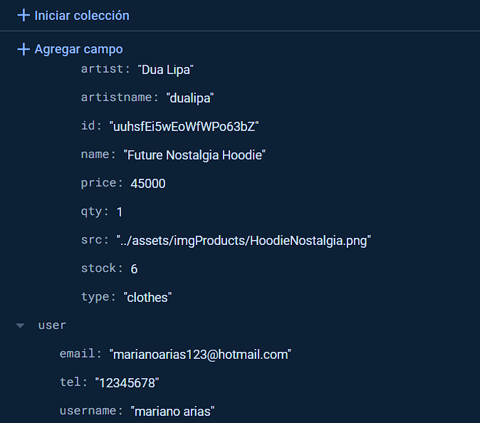

# Bienvenido a Live Pop 💽

Este proyecto es un fake E-commerce realizado para mi cursada en CODER HOUSE, espero lo disfrutes.

## Para ir al Deploy del proyecto haga click [Aquí](https://live-pop.vercel.app/)

## Tecnologías utilizadas ✨

### `React.JS` `Boostrap` `CSS` `Sweet Alert` `Toastify`

## Acerca de Live Pop 🕺💃

Este proyecto es distinto a la mayoría de los que he realizado, intentando jugar con una paleta de colores distinta a la que estoy acostumbrado a usar.

Intento generar un diseño un poco mas llamativo al habitual y a su vez no generar confusión sobre lo que ve el usuario, por eso los productos tienen un fondo de color celeste que hace resaltar los mismos del fondo y da un respiro a la vista del usuario de tantos tonos rosas.

Live Pop es una tienda virtual de música que busca combinar los CD's y el merchandising de dos artistas reconocidas, Dua Lipa y Ariana Grande
Para variar un poco en los productos los CD's al momento de entrar en el detaller genera una lista de las canciones que trae dicho CD.

Los productos se cargan en la base de datos de Firebase, donde también se generan las ordenes de los usuarios con su mail, su numero de telefono, su nombre y apellido y por supuesto los productos que selecionó 🔥.

Al momento del usuario llegar al checkout decidí incluir un resumen de los productos que selecionó 📠.

Así es como aparecerían las ordenes en Firebase con los datos del usuario 📑.

## Despedida!

Si llegaste hasta acá espero que hayas disfrutado el proyecto y que si tenés alguna recomendación siempre son bienvenidas en mi email (psst 😉, desde el footer del proyecto podes obtener la dirección de mi mail 📫).
<<<<<<< HEAD
=======

>>>>>>> 4839bfd8f871457a247c6dc68bc2da0d65bb25c9
